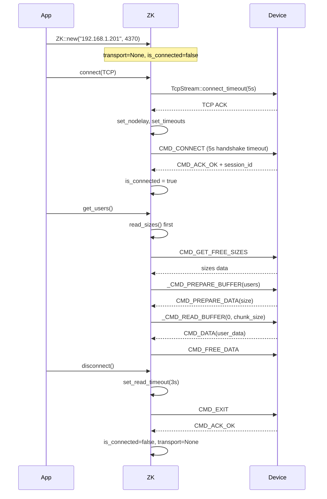

# 🔌 Connection Handling Architecture — Deep Analysis

> **Project**: rustzk | **Date**: 2026-03-05 | **Scope**: Full connection lifecycle

---

## 1. Architecture Overview

```mermaid
stateDiagram-v2
    [*] --> Disconnected: ZK::new()
    Disconnected --> TCPConnecting: connect(TCP)
    Disconnected --> UDPConnecting: connect(UDP)
    Disconnected --> TCPConnecting: connect(Auto)

    TCPConnecting --> Handshaking: TcpStream::connect_timeout(5s)
    UDPConnecting --> Handshaking: UdpSocket::bind + connect
    TCPConnecting --> UDPConnecting: Auto fallback (TCP failed)

    Handshaking --> ChecksumRetry: Timeout (wrong checksum)
    ChecksumRetry --> Connected: 2nd attempt OK
    ChecksumRetry --> Disconnected: 2nd attempt failed

    Handshaking --> Authenticating: CMD_ACK_UNAUTH
    Handshaking --> Connected: CMD_ACK_OK
    Handshaking --> Disconnected: Error

    Authenticating --> Connected: CMD_AUTH OK
    Authenticating --> Disconnected: Auth failed

    Connected --> Disconnected: disconnect()
    Connected --> Disconnected: Drop (auto)
    Connected --> Disconnected: restart() / poweroff()
```

---

## 2. Connection Lifecycle — Layer by Layer

### 2.1 Construction: `ZK::new()`

| Field | Default | Purpose |
|-------|---------|---------|
| `transport` | `None` | TCP/UDP socket wrapper |
| `session_id` | `0` | Protocol session identifier |
| `reply_id` | `USHRT_MAX - 1` | Packet sequence counter |
| `timeout` | `60s` | User-configurable data transfer timeout |
| `is_connected` | `false` | Connection state flag |
| `password` | `0` | Device comm password |
| `use_legacy_checksum` | `false` | Checksum algorithm selector |
| `udp_buf` | `vec![0u8; 2048]` | Reusable UDP read buffer |

> [!TIP]
> `udp_buf` is pre-allocated at construction time to avoid per-packet heap allocation during UDP reads — a deliberate performance optimization.

### 2.2 TCP Connection: `connect_tcp()`

```
1. DNS resolution → to_socket_addrs()
2. TcpStream::connect_timeout(&addr, 5s) — bounded connect
3. stream.set_nodelay(true) — disable Nagle's algorithm
4. stream.set_read_timeout(Some(self.timeout)) — default 60s
5. stream.set_write_timeout(Some(self.timeout))
6. self.transport = Some(ZKTransport::Tcp(stream))
7. perform_connect_handshake()
```

### 2.3 UDP Connection: `connect_udp()`

```
1. UdpSocket::bind("0.0.0.0:0") — ephemeral port
2. socket.connect(&self.addr) — associate with device
3. socket.set_read_timeout(Some(self.timeout))
4. socket.set_write_timeout(Some(self.timeout))
5. self.transport = Some(ZKTransport::Udp(socket))
6. perform_connect_handshake()
```

### 2.4 Handshake: `perform_connect_handshake()`

This is the most complex part of connection establishment. It implements **auto-detection** of the checksum algorithm.

```
Attempt 1 (5s timeout):
  → send CMD_CONNECT with current checksum
  ├── OK → finish_handshake() → Connected
  ├── Timeout → flip use_legacy_checksum, retry
  └── Other error → fail

Attempt 2 (5s timeout, if needed):
  → send CMD_CONNECT with flipped checksum
  ├── OK → finish_handshake() → Connected
  └── Any error → fail

Finally: restore original timeout (60s)
```

**Key design decision**: Handshake uses a **5s per-attempt timeout** (not the full 60s), so auto-detection completes in **≤10s worst case**.

### 2.5 Authentication: `finish_handshake()`

```
If CMD_ACK_OK → is_connected = true, done
If CMD_ACK_UNAUTH → 
  1. Generate commkey from password + session_id
  2. Send CMD_AUTH with commkey
  3. Verify response
  4. is_connected = true
```

### 2.6 Disconnection: `disconnect()`

```rust
pub fn disconnect(&mut self) -> ZKResult<()> {
    if self.is_connected {
        self.set_transport_read_timeout(Duration::from_secs(3)); // Short timeout
        let _ = self.send_command(CMD_EXIT, &[]);                // Ignore errors
        self.is_connected = false;
    }
    self.transport = None;  // Drop socket → OS closes connection
    Ok(())
}
```

### 2.7 Drop Semantics

```rust
impl Drop for ZK {
    fn drop(&mut self) {
        if self.is_connected {
            let _ = self.disconnect();  // Auto-disconnect with 3s timeout
        }
    }
}
```

> [!IMPORTANT]
> `Drop` calls `disconnect()`, which uses a **3s timeout**. This means Drop can block for up to 3s if the device is unreachable. This is an acceptable tradeoff: it ensures proper protocol cleanup while preventing the 60s hang.

---

## 3. Data Transfer Patterns

### 3.1 Command/Response Cycle: `send_command()`

```
1. Increment reply_id (wrapping at USHRT_MAX)
2. Build ZKPacket (with checksum)
3. TCP: prepend TCPWrapper header (magic + length)
   UDP: send raw packet
4. read_response_safe() → wait for matching reply_id
```

### 3.2 Response Validation: `read_response_safe()`

```
loop {
    packet = read_packet()
    if packet.reply_id == self.reply_id → return Ok(packet)
    else → discard (max 100 discards before error)
}
```

> [!NOTE]
> The 100-packet discard limit prevents unbounded loops from stale/misordered packets. Total worst case: `100 × socket_timeout`.

### 3.3 Bulk Data Transfer: `read_with_buffer()`

```
1. Send _CMD_PREPARE_BUFFER → get total data size
2. Loop: read_chunk_into() with max chunk = TCP(65535) / UDP(16000)
3. Each chunk: _CMD_READ_BUFFER → CMD_DATA response
4. Empty response protection: max 20 retries with exponential backoff
5. Send CMD_FREE_DATA to release device buffer
```

### 3.4 Real-time Events: `listen_events()`

```
1. reg_event(EF_ATTLOG) → register for events
2. Iterator: read_packet() → decode event → send_ack_ok() back
3. Timeout/WouldBlock → yield None (expected idle behavior)
4. Network error → yield Some(Err(...))
```

---

## 4. Safety Properties

### 4.1 Timeout Bounds

| Operation | Timeout | Bounded? |
|-----------|---------|----------|
| TCP connect | 5s | ✅ Hard limit |
| Handshake attempt 1 | 5s | ✅ Short probe |
| Handshake attempt 2 | 5s | ✅ Short probe |
| Data read/write | 60s (configurable) | ✅ Socket timeout |
| Disconnect | 3s | ✅ Short timeout |
| Drop | 3s (via disconnect) | ✅ |
| `read_response_safe` | 100 × socket_timeout | ⚠️ Bounded but large |

### 4.2 Connection Guards

| Guard | Present? | Location |
|-------|----------|----------|
| Double-connect prevention | ✅ | `connect()` line 158 |
| `is_connected` check before `CMD_EXIT` | ✅ | `disconnect()` line 1116 |
| Transport `None` guard | ✅ | `send_command()` line 440 |
| Timeout restore after handshake | ✅ | `perform_connect_handshake()` |
| Double-disconnect prevention | ✅ | `Drop` checks `is_connected` |

### 4.3 Error Recovery

| Scenario | Handling |
|----------|----------|
| TCP connect refused | Return `ZKError::Network` immediately |
| Handshake wrong checksum | Auto-flip and retry (1 retry) |
| Device unreachable during data | Socket timeout → `ZKError::Network` |
| `disconnect()` on dead device | 3s timeout, error ignored |
| `Drop` on dead device | 3s timeout via `disconnect()`, error ignored |
| Packet mismatch (wrong reply_id) | Discard up to 100 packets |
| Oversized packet | `validate_packet_size()` rejects > 1MB |
| Too many empty chunks | 20 retries with backoff, then error |

### 4.4 Resource Cleanup

| Resource | Cleanup Mechanism |
|----------|-------------------|
| TCP/UDP socket | `self.transport = None` → Rust Drop |
| Device session | `CMD_EXIT` sent before socket close |
| Memory (`udp_buf`) | Struct ownership → automatic |
| `is_connected` flag | Reset in `disconnect()`, `restart()`, `poweroff()` |

---

## 5. Architectural Strengths

1. **Bounded everything** — No unbounded waits at any point in the protocol
2. **Checksum auto-detection** — Handles firmware variations transparently
3. **Short disconnect timeout** — 3s instead of 60s prevents Drop hangs
4. **Pre-allocated UDP buffer** — Avoids per-packet heap allocation
5. **Packet size validation** — Prevents memory exhaustion attacks via `security.rs`
6. **Protocol-agnostic transport** — `ZKTransport` enum cleanly abstracts TCP/UDP
7. **Comprehensive test coverage** — Mock servers test: fragmented TCP, auto-fallback, double-connect, drop behavior, short-response errors, infinite loop protection

---

## 6. Remaining Improvement Opportunities

### 6.1 🟡 Transport Not `Send`/`Sync`

`ZK` struct holds `Option<ZKTransport>` with non-thread-safe `TcpStream`/`UdpSocket`. Cannot be shared across threads without external synchronization (e.g., `Arc<Mutex<ZK>>`).

**Impact**: Users building concurrent pollers (like `agent-main`) must wrap `ZK` in `Arc<Mutex<>>` manually.

### 6.2 🟡 No Connection Health Check

No built-in `is_alive()` or ping method. Users must call a lightweight command (e.g., `get_firmware_version()`) to verify the connection is still valid.

### 6.3 🟢 `listen_events()` Iterator Terminates on Timeout

The event iterator returns `None` on timeout, which ends the iterator per Rust conventions. Users must call `listen_events()` again to resume. This is by design (pull-based), but requires the caller to implement a retry loop.

### 6.4 🟢 `restart()` / `poweroff()` Don't Wait for ACK

Both methods send the command and immediately set `is_connected = false`. If `send_command()` succeeds, the device ACK'd — but the subsequent device restart means the connection is dead anyway. Correct behavior.

---

## 7. Sequence Diagram — Full Lifecycle



---

## 8. Test Coverage Summary

| Test File | Tests | Coverage Area |
|-----------|-------|---------------|
| [drop_tests.rs](file:///home/elt1541/lee/rustzk/tests/drop_tests.rs) | 4 tests | Auto-disconnect from Drop, manual then drop, double-connect guard, short disconnect timeout |
| [client_tests.rs](file:///home/elt1541/lee/rustzk/tests/client_tests.rs) | 8+ tests | Full device flow, UDP connect, TCP fragmentation, short response, chunk fragmentation, auto fallback, GBK encoding, infinite loop protection |
| [auth_tests.rs](file:///home/elt1541/lee/rustzk/tests/auth_tests.rs) | — | Authentication flow |
| [ack_flow_test.rs](file:///home/elt1541/lee/rustzk/tests/ack_flow_test.rs) | — | ACK packet handling |
| [lib.rs (unit)](file:///home/elt1541/lee/rustzk/src/lib.rs#L1620-L1662) | 4 tests | `make_commkey`, password setting |

---

## 9. Verdict

Connection handling architecture is **production-grade**:

- ✅ All paths have bounded timeouts (no infinite hangs)
- ✅ Proper cleanup on all exit paths (normal, error, Drop)
- ✅ Defense-in-depth: packet validation, discard limits, backoff protection
- ✅ Auto-detection of firmware-specific checksum variants
- ✅ Comprehensive test coverage with mock servers

The two medium-severity items from the earlier review (disconnect timeout, double-connect guard) have both been **resolved**. The remaining opportunities (thread safety, health check, event iterator) are **enhancement-level**, not bugs.
