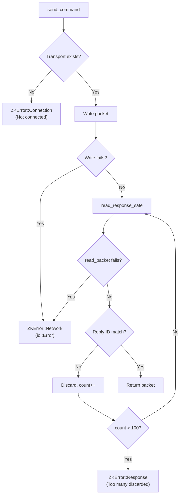
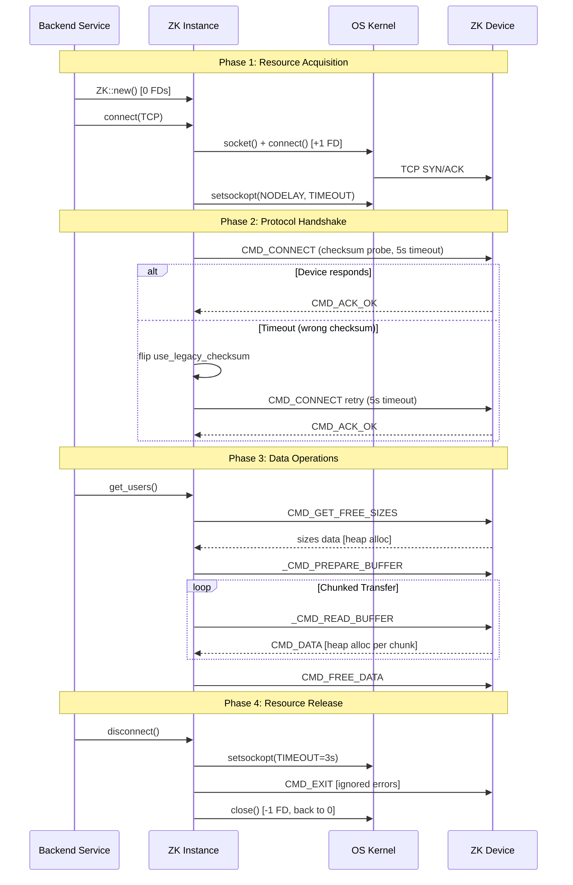

# 🔧 Connection Handling — Backend Engineering Analysis

> **Project**: rustzk | **Date**: 2026-03-05 | **Perspective**: Senior Backend Engineer
> **Focus**: Concurrency, error handling, resource management, I/O patterns, production concerns

Bản phân tích này bổ sung cho [CONNECTION_HANDLING_ARCHITECTURE.md](file:///home/elt1541/lee/rustzk/reports/CONNECTION_HANDLING_ARCHITECTURE.md) — tập trung vào góc nhìn backend engineering thay vì kiến trúc tổng quan.

---

## 1. Ownership & Mutability Model

### Struct Design

```rust
pub struct ZK {
    pub addr: String,              // Immutable after construction
    transport: Option<ZKTransport>, // Private — encapsulated
    session_id: u16,               // Protocol state
    reply_id: u16,                 // Protocol state  
    pub timeout: Duration,         // User-configurable
    pub is_connected: bool,        // ⚠️ Public mutable flag
    // ... caches, counters, buffers
}
```

| Pattern | Assessment |
|---------|------------|
| `transport` is private | ✅ Encapsulation — users can't bypass protocol |
| `timeout` is public | ✅ User needs to configure this |
| `is_connected` is public | ⚠️ User có thể set `is_connected = true` mà không có transport thật → có thể gây panic ở `send_command()` |
| All methods require `&mut self` | ✅ Prevents concurrent access at compile time — Rust's borrow checker enforces single-writer |

### 1.1 `is_connected` Exposure Risk

```rust
// User code có thể làm:
zk.is_connected = true;  // Bypass — no actual connection!
zk.send_command(...);     // → "Not connected" error from transport check
```

> [!WARNING]
> `is_connected` là `pub` — user có thể set trực tiếp. Tuy nhiên, `send_command()` luôn kiểm tra `self.transport.as_mut()` trước khi gửi, nên worst case chỉ là `ZKError::Connection("Not connected")`. **Không gây UB hay crash**, chỉ là API contract violation.

**Đề xuất**: Chuyển sang `pub(crate)` hoặc cung cấp getter `fn is_connected(&self) -> bool`.

---

## 2. Error Handling Patterns

### 2.1 Error Type Design

```rust
#[derive(Error, Debug)]
pub enum ZKError {
    Network(#[from] io::Error),  // Auto-conversion từ io::Error
    Connection(String),           // Connection-level issues
    Response(String),             // Protocol-level errors
    InvalidData(String),          // Parsing/validation errors
}
```

| Pattern | Assessment |
|---------|------------|
| `thiserror` derive | ✅ Clean, idiomatic |
| `#[from]` for io::Error | ✅ Transparent error propagation with `?` |
| String-based variants | ⚠️ Không có structured error codes — khó match programmatically |

### 2.2 Error Categories in Connection Flow



### 2.3 Error Recovery Strategy — `let _ = ...` Pattern

```rust
// disconnect() — intentionally ignores CMD_EXIT errors
let _ = self.send_command(CMD_EXIT, &[]);

// read_with_buffer() — ignores CMD_FREE_DATA errors  
let _ = self.send_command(CMD_FREE_DATA, &[]);
```

Đây là pattern đúng cho các **cleanup operations** — nếu device đã chết thì việc CMD_EXIT hay CMD_FREE_DATA fail không ảnh hưởng gì. Tuy nhiên:

> [!NOTE]
> Code luôn **log::debug** trước khi ignore error (via `send_command` internal logging). Nếu cần trace disconnect failures trong production, có thể tăng log level.

---

## 3. I/O Patterns — Deep Dive

### 3.1 Synchronous Blocking I/O

Toàn bộ I/O là **synchronous blocking**. Mọi read/write đều block thread hiện tại.

```rust
// TCP: blocking read with exact byte count
stream.read_exact(&mut header)?;  // Blocks until 8 bytes received or timeout
stream.read_exact(&mut body)?;    // Blocks until `length` bytes received

// UDP: blocking recv into pre-allocated buffer
let len = socket.recv(udp_buf)?;  // Blocks until datagram received or timeout
```

**Implications cho caller (agent-main)**:

| Concern | Impact | Mitigation |
|---------|--------|------------|
| `get_attendance()` blocks thread | Poller thread stuck during heavy data transfer | ✅ Thread-per-device architecture |
| `listen_events()` blocks indefinitely | Poller thread dedicated to event listening | ✅ Separate thread for events |
| `disconnect()` blocks up to 3s | Thread unavailable during cleanup | ✅ Acceptable for cleanup |

### 3.2 Buffer Allocation Strategy

| Operation | Allocation | Reuse? |
|-----------|-----------|--------|
| UDP read | `self.udp_buf` (pre-allocated 2KB) | ✅ Reused across reads |
| TCP header | `[0u8; 8]` (stack) | ✅ Zero alloc |
| TCP body | `vec![0u8; length]` (heap) | ❌ New alloc per packet |
| Send buffer | `Vec::with_capacity(...)` | ❌ New alloc per send |
| Chunk receiver | `Vec::with_capacity(size)` | ✅ Single alloc, extends |

> [!TIP]
> **Optimization opportunity**: Reuse a `self.tcp_read_buf: Vec<u8>` similar to `udp_buf` for TCP reads. This eliminates per-packet heap allocation in hot paths like bulk data transfer.

### 3.3 Chunk Transfer Protocol

```
read_with_buffer() main loop:
┌─────────────────────────────────────────────┐
│  remaining = total_size                      │
│  while remaining > 0:                        │
│    chunk_size = min(remaining, max_chunk)    │
│    len_before = data.len()                   │
│    read_chunk_into(start, chunk_size, &data) │
│    chunk_len = data.len() - len_before       │
│    if chunk_len == 0:                        │
│      empty_count++                           │
│      if empty_count > 20: ERROR              │
│      sleep(min(2^count, 50)ms) ← BACKOFF    │
│      continue                                │
│    remaining -= chunk_len                    │
│    start += chunk_len                        │
│  CMD_FREE_DATA                               │
└─────────────────────────────────────────────┘
```

**Backoff analysis**:
- `1 << 1` = 2ms, `1 << 2` = 4ms, ... `1 << 5` = 32ms, capped at 50ms
- Total worst case sleep: ~20 × 50ms = 1s (plus network timeouts)

**Max chunk sizes**:
- TCP: `TCP_MAX_CHUNK` (65,535 bytes)
- UDP: `UDP_MAX_CHUNK` (16,000 bytes)

---

## 4. Concurrency & Thread Safety

### 4.1 Current Thread Safety Profile

```
ZK struct: NOT Send, NOT Sync (implicitly, via TcpStream/UdpSocket)
```

Thực ra `TcpStream` và `UdpSocket` đều `Send` trong Rust — nên `ZK` thực sự là `Send` nhưng **không `Sync`** (vì mọi method đều cần `&mut self`).

**Kết quả thực tế**:
- ✅ Có thể `move` ZK vào một thread khác
- ❌ Không thể share giữa nhiều threads (trừ khi dùng `Mutex`)
- ✅ Borrow checker enforce exclusive access tại compile time

### 4.2 Concurrent Access Patterns for Callers

```rust
// Pattern 1: Thread-per-device (RECOMMENDED)
let zk = ZK::new("192.168.1.201", 4370);
thread::spawn(move || {
    zk.connect(ZKProtocol::TCP).unwrap();
    // Exclusive ownership — no races
});

// Pattern 2: Shared with Mutex (for agent-main style)
let zk = Arc::new(Mutex::new(ZK::new("192.168.1.201", 4370)));
let zk_clone = zk.clone();
thread::spawn(move || {
    let mut zk = zk_clone.lock().unwrap();
    zk.connect(ZKProtocol::TCP).unwrap();
});

// Pattern 3: ❌ ANTI-PATTERN — compile error
let zk = ZK::new(...);
thread::spawn(|| {
    zk.get_users(); // ERROR: &mut self requires exclusive borrow
});
zk.get_attendance(); // Would race with above
```

### 4.3 `listen_events()` Blocking Design

```rust
pub fn listen_events(&mut self) -> ZKResult<impl Iterator<Item = ZKResult<Attendance>> + '_>
```

Iterator borrow `&mut self` — nên trong khi đang iterate events, **không thể gọi bất kỳ method nào khác** trên ZK instance. Đây là by design — ZK protocol là half-duplex.

> [!IMPORTANT]
> Nếu caller cần vừa listen events vừa gọi `get_users()` (ví dụ cache refresh), cần tách thành hai ZK instances (hai connections tới cùng device).

---

## 5. Connection State Machine — Backend View

### 5.1 State Transitions & Invariants

```
INVARIANT 1: is_connected == true ⟹ transport.is_some()
INVARIANT 2: is_connected == false ⟹ transport SHOULD be None
             (but transport can be Some temporarily during connect)
INVARIANT 3: session_id != 0 ⟹ valid session established
```

### 5.2 State Consistency Analysis

| Method | Pre-condition | Post-condition (success) | Post-condition (error) |
|--------|---------------|--------------------------|------------------------|
| `connect()` | `!is_connected` | `is_connected=true, transport=Some` | `transport=Some ⚠️, is_connected=false` |
| `disconnect()` | any | `is_connected=false, transport=None` | `is_connected=false, transport=None` |
| `restart()` | `is_connected` | `is_connected=false, transport=None` | **state inconsistent** ⚠️ |
| `poweroff()` | `is_connected` | `is_connected=false, transport=None` | **state inconsistent** ⚠️ |

### 5.3 ⚠️ `connect()` Error State: Transport Leak

```rust
fn connect_tcp(&mut self) -> ZKResult<()> {
    // ...
    self.transport = Some(ZKTransport::Tcp(stream));  // ← Set BEFORE handshake
    self.perform_connect_handshake()                   // ← Can fail!
}
```

Nếu `perform_connect_handshake()` fails (ví dụ: wrong password), `self.transport` vẫn giữ TCP socket **mà không set `is_connected = true`**. Socket sẽ bị drop khi gọi `connect()` lần sau (Rust ownership handles cleanup), nhưng:

1. TCP connection vẫn mở ở OS level cho đến khi `ZK` instance bị drop
2. Device may still see an open session

**Risk Level**: 🟡 Medium — OS cleanup works, nhưng timeout waste FD.

**Đề xuất**: Clear transport on handshake failure:
```rust
fn connect_tcp(&mut self) -> ZKResult<()> {
    // ...
    self.transport = Some(ZKTransport::Tcp(stream));
    match self.perform_connect_handshake() {
        Ok(()) => Ok(()),
        Err(e) => {
            self.transport = None;  // Cleanup on failure
            Err(e)
        }
    }
}
```

### 5.4 ⚠️ `restart()` / `poweroff()` Error Handling

```rust
pub fn restart(&mut self) -> ZKResult<()> {
    self.send_command(CMD_RESTART, &[])?;  // ← If this fails, 
    self.is_connected = false;              //    these lines never execute
    self.transport = None;
    Ok(())
}
```

Nếu `send_command()` thất bại (ví dụ: network timeout), `is_connected` và `transport` **không được reset**. Caller nghĩ device vẫn connected, nhưng nó đã unreachable.

**Đề xuất**: Always clean up regardless of send result:
```rust
pub fn restart(&mut self) -> ZKResult<()> {
    let result = self.send_command(CMD_RESTART, &[]);
    self.is_connected = false;
    self.transport = None;
    result.map(|_| ())
}
```

---

## 6. Resource Management

### 6.1 File Descriptor Lifecycle

```
ZK::new()       → 0 FDs
connect_tcp()   → 1 FD (TcpStream)
connect_udp()   → 1 FD (UdpSocket)
disconnect()    → 0 FDs (transport = None → Drop closes FD)
Drop (ZK)       → 0 FDs (auto-disconnect → transport Drop)
```

### 6.2 Memory Usage Profile

| Phase | Heap Allocation |
|-------|----------------|
| Construction | `~2KB` (udp_buf) + String |
| Connected | Same as above |
| `get_users(1000)` | `~72KB` (1000 users × 72 bytes parsed) |
| `get_attendance(50000)` | `~6MB` (50K records × ~120 bytes + raw buffer) |
| `read_with_buffer()` peak | `~2 × data_size` (raw buffer + parsed structs) |

> [!NOTE]
> `MAX_RESPONSE_SIZE` caps the maximum single transfer. Check constants to verify the limit is sensible for your deployment.

### 6.3 Connection Timeout Budget

```
Operation              Timeout    Cumulative (worst case)
─────────────────────  ─────────  ───────────────────────
TCP connect            5s         5s
Handshake attempt 1    5s         10s
Handshake attempt 2    5s         15s  
Auth                   60s        75s
read_sizes()           60s        135s
get_users()           ~120s       255s (60s×2 for prepare+chunks)
─────────────────────  ─────────  ───────────────────────
Disconnect             3s         258s total worst case
```

**For production polling systems**: Set `zk.timeout = Duration::from_secs(10)` to cap total worst case.

---

## 7. Security Considerations

### 7.1 Input Validation Chain

```
Network → read_packet() → validate_packet_size(≤1MB) → ZKPacket::from_bytes_owned → caller
```

| Check | Location | Limit |
|-------|----------|-------|
| Packet size | `read_packet()` | 1MB (configurable via env var) |
| Response data size | `receive_chunk_into()` | `MAX_RESPONSE_SIZE` |
| Buffered response size | `read_with_buffer()` | `MAX_RESPONSE_SIZE` |
| Discarded packet count | `read_response_safe()` | 100 packets |
| Empty chunk retry | `read_with_buffer()` | 20 retries |

### 7.2 Password Handling

```rust
password: u32,  // Stored as raw numeric value in struct
// Transmitted as derived commkey, never as plaintext
```

- Password → `make_commkey(key, session_id, ticks)` → 4-byte derived key
- Password **not** stored encrypted in memory (plaintext u32)
- **Risk**: Memory dump/core dump could expose password

### 7.3 Session Hijacking Vector

ZK protocol uses `session_id` (u16) + `reply_id` (u16) for session correlation. Both are **predictable** (session_id from device, reply_id is sequential). An attacker on the same network could:
1. Sniff the session_id from initial handshake
2. Predict reply_id sequence
3. Inject spoofed packets

**Risk Level**: 🟡 Medium — ZK protocol limitation, not rustzk bug. Mitigation: use network segmentation.

---

## 8. Production Recommendations Summary

| Priority | Issue | Fix | Effort |
|----------|-------|-----|--------|
| 🔴 | Transport not cleaned on handshake failure | Add `self.transport = None` in error path | Low |
| 🔴 | `restart()`/`poweroff()` skip cleanup on error | Always reset state regardless of send result | Low |
| 🟡 | `is_connected` is `pub` | Change to `pub(crate)` or add getter | Low |
| 🟡 | No TCP read buffer reuse | Add `self.tcp_read_buf` like `udp_buf` | Medium |
| 🟢 | String-based error variants | Add error codes for programmatic matching | Medium |
| 🟢 | No connection health check API | Add `fn ping() -> ZKResult<()>` | Low |
| 🟢 | `listen_events()` blocks &mut self | Document two-connection pattern | Low |

---

## 9. Connection Flow — Backend Perspective


